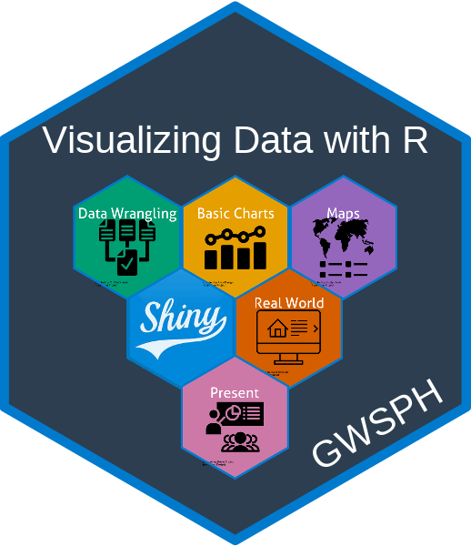

<!-- README.md is generated from README.Rmd. Please edit that file -->

## PUBH 6199: Visualizing Data with R 

<!-- badges: start -->

<!-- badges: end -->

### Description

👋 Welcome to the course website for
“[PUBH](https://publichealth.gwu.edu/departments/environmental-and-occupational-health)
6199: Visualizing Data with R” at the [George Washington
University](https://www.gwu.edu/)!

Students will learn how to design and implement data visualization based
on the data type at hand and communicate complex public health
information clearly and effectively to diverse audiences, including
policymakers, healthcare professionals, and the general public.

### Acknowledgments

This course was inspired by many other courses / resources that cover
similar material - see the course [about
page](http://https://pubh6199-data-viz-with-r.github.io/about.html) for
more details.
